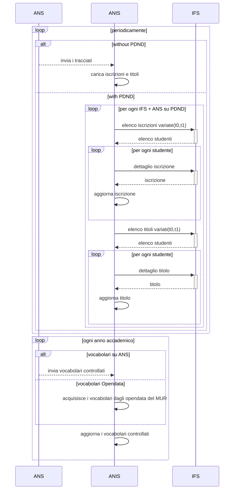

```mermaid
sequenceDiagram
    loop periodicamente
        alt without PDND
            ANS-->>ANIS: invia i tracciati
            ANIS->>ANIS: carica iscrizioni e titoli
        else with PDND
            loop per ogni IFS + ANS su PDND
                ANIS->>+IFS: elenco iscrizioni variate(t0,t1)
                IFS-->>-ANIS: elenco studenti
                loop per ogni studente
                    ANIS->>+IFS: dettaglio iscrizione
                    IFS-->>-ANIS: iscrizione
                    ANIS->>ANIS: aggiorna iscrizione
                end
                ANIS->>+IFS: elenco titoli variati(t0,t1)
                IFS-->>-ANIS: elenco studenti
                loop per ogni studente
                    ANIS->>+IFS: dettaglio titolo
                    IFS-->>-ANIS: titolo
                    ANIS->>ANIS: aggiorna titolo
                end
            end
        end
    end
    loop ogni anno accademico
        alt vocabolari su ANS
            ANS-->>ANIS: invia vocabolari controllati
        else vocabolari Opendata
            ANIS->>ANIS: acquisisce i vocabolari dagli opendata del MUR
        end
        ANIS->>ANIS: aggiorna i vocabolari controllati
    end
```