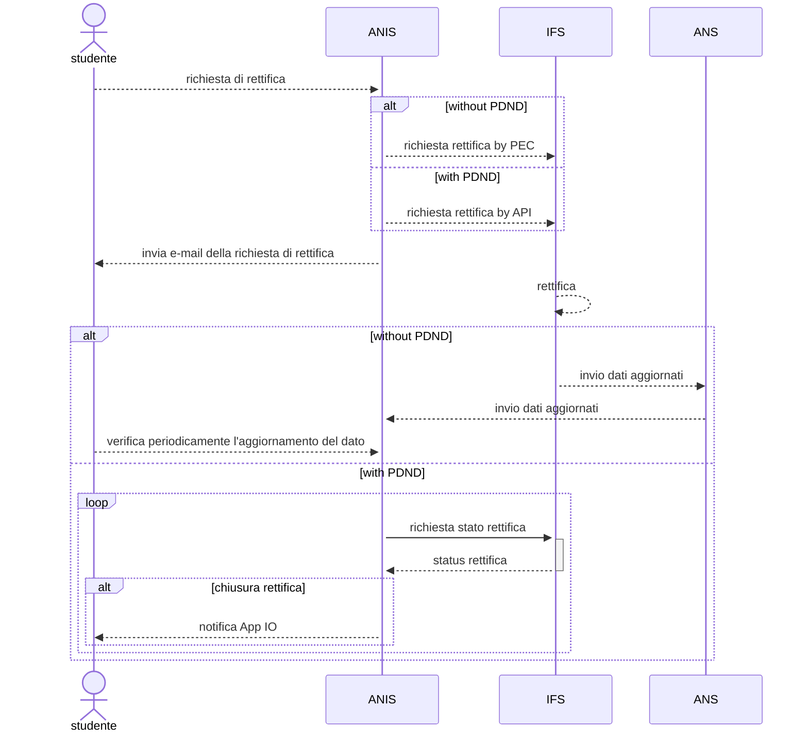

```mermaid
sequenceDiagram
    actor studente
    studente-->>+ANIS: richiesta di rettifica
    alt without PDND
    ANIS-->>IFS: richiesta rettifica by PEC
    else with PDND
    ANIS-->>IFS: richiesta rettifica by API
    end
    ANIS-->>studente: invia e-mail della richiesta di rettifica
    IFS-->>+IFS:rettifica
    alt without PDND
    IFS-->>ANS: invio dati aggiornati
    ANS-->>ANIS: invio dati aggiornati
    studente-->>ANIS: verifica periodicamente l'aggiornamento del dato
    else with PDND
        loop
            ANIS->>+IFS: richiesta stato rettifica
            IFS-->>-ANIS: status rettifica 
            alt chiusura rettifica
                ANIS-->>studente: notifica App IO
            end
        end
    end  
```